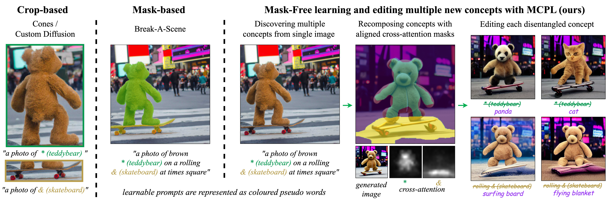
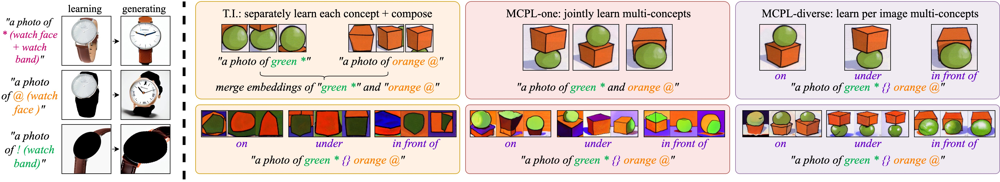
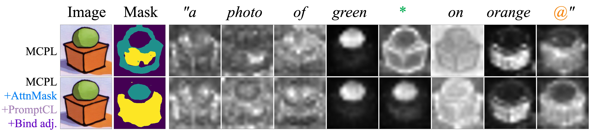
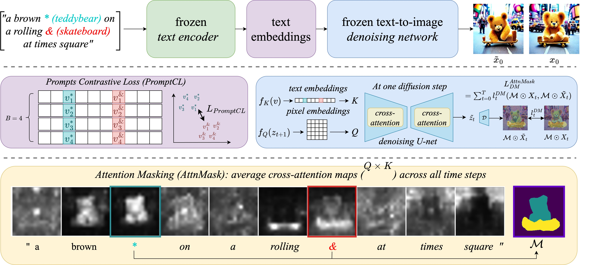
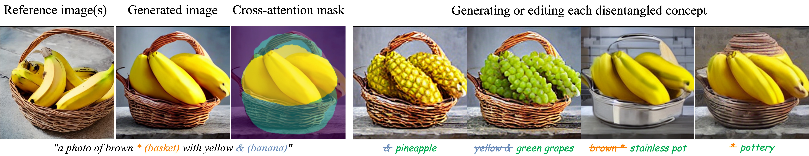
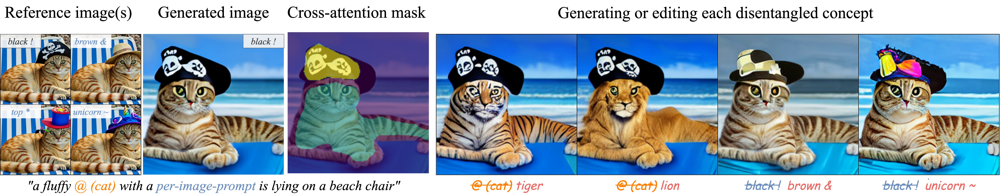
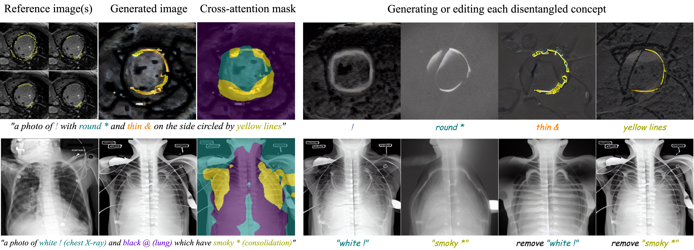

# An Image is Worth Multiple Words: Discovering Object Level Concepts using Multi-Concept Prompt Learning

<a href="https://astrazeneca.github.io/mcpl.github.io/"></a>
<a href="https://arxiv.org/abs/2310.12274"></a>
<a href="https://www.apache.org/licenses/LICENSE-2.0.txt"></a>
<a href="https://pytorch.org/">=1.10.0-Red?logo=pytorch"></a>
[](https://huggingface.co/papers/2310.12274)




> <a href="https://astrazeneca.github.io/mcpl.github.io">**An Image is Worth Multiple Words: Discovering Object Level Concepts using Multi-Concept Prompt Learning**</a>
>
> <a href="https://chenjin.netlify.app/">Chen Jin<sup>1</sup></a> 
    <a href="https://rt416.github.io/">Ryutaro Tanno<sup>2</sup></a> 
    <a href="https://uk.linkedin.com/in/amrutha-saseendran">Amrutha Saseendran<sup>1</sup> </a> 
    <a href="https://tomdiethe.com/">Tom Diethe<sup>1</sup></a> 
    <a href="https://uk.linkedin.com/in/philteare">Philip Teare<sup>1</sup></a><br>
>
> Multi-Concept Prompt Learning (MCPL) pioneers **mask-free** **text-guided** learning for multiple prompts from **one scene**. Our approach not only enhances current methodologies but also paves the way for novel applications, such as facilitating knowledge discovery through natural language-driven interactions between humans and machines.

## Motivation

We use Textural Inversion (T.I.) to learn concepts from both masked (left-first) or cropped (left-second) images; MCPL-one, learning both concepts jointly from the full image with a single string; and MCPL-diverse accounting for per-image specific relationships


Naive learning multiple text embeddings from single image-sentence pair without imagery guidence lead to miss-alignment in per-word cross attention (top). We propose three regularisation terms to enhance the accuracy of prompt-object level correlation (bottom).

## Method


## Applications

### Multiple concepts from single image


### Per-image different multiple concepts 


### Out-of-Distribution concept discovery and hypothesis generation


## Dataset
We generate and collected a [Multi-Concept-Dataset](dataset) including a total of ~ 1400 images and masked objects/concepts as follows

  /  (370 images)
  /natural_2_concepts  
  /natural_345_concepts  
  /real_natural_concepts

| Data file name | Size | # of images |
| --- | --- | ---: |
| [medical_2_concepts](dataset/medical_2_concepts/) | 2.5M | 370 |
| [natural_2_concepts](dataset/natural_2_concepts/) | 36M | 415 |
| [natural_345_concepts](dataset/natural_345_concepts/) | 13M | 525 |
| [real_natural_concepts](dataset/real_natural_concepts/) | 5.6M | 137 |


## Setup

Our code builds on, and shares requirements with [Latent Diffusion Models (LDM)](https://github.com/CompVis/latent-diffusion). To set up their environment, please run:

```
conda env create -f environment.yaml
conda activate ldm
```

```
pip install -e git+https://github.com/CompVis/taming-transformers.git@master#egg=taming-transformers
cd ./src/taming-transformers
pip install -e .
```

You will also need the official LDM text-to-image checkpoint, available through the [LDM project page](https://github.com/CompVis/latent-diffusion). 

Currently, the model can be downloaded by running:

```
mkdir -p models/ldm/text2img-large/
wget -O models/ldm/text2img-large/model.ckpt https://ommer-lab.com/files/latent-diffusion/nitro/txt2img-f8-large/model.ckpt
```


## Learning 

### MCPL-all: a naive approach that learns em-beddings for all prompts in the string (including adjectives, prepositions and nouns. etc.)
- specify the placeholder_string to describe your multi-concept images;
- in presudo_words we specify to learn every word in the placeholder_string;

```
python main.py --base configs/latent-diffusion/txt2img-1p4B-finetune.yaml \
                -t \
                --actual_resume </path/to/pretrained/model.ckpt> \
                -n <run_name> \
                --gpus 0, \
                --data_root </path/to/directory/with/images> \
                --init_word <initialization_word> \
                --placeholder_string 'green * and orange @' \
                --presudo_words 'green,*,and,orange,@'
```

### MCPL-one: which simplifies the objective by learning single prompt (nouns) per concept
- in this case, in presudo_words we specify to learn only a subset of words in the placeholder_string;

```
python main.py --base configs/latent-diffusion/txt2img-1p4B-finetune.yaml \
                -t \
                --actual_resume </path/to/pretrained/model.ckpt> \
                -n <run_name> \
                --gpus 0, \
                --data_root </path/to/directory/with/images> \
                --init_word <initialization_word> \
                --placeholder_string 'green * and orange @' \
                --presudo_words '*,@'
```

### MCPL-diverse: where different strings are learned per image to observe variances among examples
- before start, name each training image using single word representing relation; 
- e.g. in the ball and box exp, we train with: <'front.jpg,  next.jpg,  on.jpg,  under.jpg'>;
- in placeholder_string we describe the multi-concept, and use 'RELATE' as placeholder of relationship between multi-concepts;
- in presudo_words, we specify all presudo_words include relations to be learnt, the per-image relation will be injected via replace 'RELATE' with the relation specified by each image's name;

```
python main.py --base configs/latent-diffusion/txt2img-1p4B-finetune.yaml \
                -t \
                --actual_resume </path/to/pretrained/model.ckpt> \
                -n <run_name> \
                --gpus 0, \
                --data_root </path/to/directory/with/images> \
                --init_word <initialization_word> \
                --placeholder_string 'green * RELATE orange @' \
                --presudo_words '*,@,on,under,next,front'
```

### Regularisation-1: adding PromptCL and Bind adjective (teddybear skateboard example)

```
python main.py --base configs/latent-diffusion/txt2img-1p4B-finetune.yaml \
                -t \
                --actual_resume </path/to/pretrained/model.ckpt> \
                -n <run_name> \
                --gpus 0, \
                --data_root </path/to/directory/with/images> \
                --init_word <initialization_word> \
                --placeholder_string 'a brown @ on a rolling * at times square' \
                --presudo_words 'a,brown,on,rolling,at,times,square,@,*' \
                --attn_words 'brown,rolling,@,*' \
                --presudo_words_softmax '@,*' \
                --presudo_words_infonce '@,*' \
                --infonce_temperature 0.2 \
                --infonce_scale 0.0005 \
                --adj_aug_infonce 'brown,rolling' \
                --attn_mask_type 'skip'
```

### Regularisation-2: adding PromptCL, Bind adjective and Attention Mask (teddybear skateboard example)

```
python main.py --base configs/latent-diffusion/txt2img-1p4B-finetune.yaml \
                -t \
                --actual_resume </path/to/pretrained/model.ckpt> \
                -n <run_name> \
                --gpus 0, \
                --data_root </path/to/directory/with/images> \
                --init_word <initialization_word> \
                --placeholder_string 'a brown @ on a rolling * at times square' \
                --presudo_words 'a,brown,on,rolling,at,times,square,@,*' \
                --attn_words 'brown,rolling,@,*' \
                --presudo_words_softmax '@,*' \
                --presudo_words_infonce '@,*' \
                --infonce_temperature 0.3 \
                --infonce_scale 0.00075 \
                --adj_aug_infonce 'brown,rolling'
```


## Generation

To generate new images of the learned concept, run:
```
python scripts/txt2img.py --ddim_eta 0.0 
                          --n_samples 8 
                          --n_iter 2 
                          --scale 10.0 
                          --ddim_steps 50 
                          --embedding_path /path/to/logs/trained_model/checkpoints/embeddings_gs-5049.pt 
                          --ckpt_path /path/to/pretrained/model.ckpt 
                          --prompt "a photo of green * and orange @"
```

where * and @ is the placeholder string used during inversion.

## FAQ

**bert tokenizer error**
Sometimes one may get the following error due to the intrinsic error of tokenizer, simply try a different word with similar meaning.
For example in the error below, replace 'peachy' in your prompt with 'splendid' would resolve the issue.
```
File "/YOUR-HOME-PATH/MCPL/ldm/modules/embedding_manager.py", line 22, in get_bert_token_for_string
    assert torch.count_nonzero(token) == 3, f"String '{string}' maps to more than a single token. Please use another string"
AssertionError: String 'peachy' maps to more than a single token. Please use another string
```

## Citation

If you make use of our work, please cite our paper:

```
@article{jin2023image,
  title={An image is worth multiple words: Learning object level concepts using multi-concept prompt learning},
  author={Jin, Chen and Tanno, Ryutaro and Saseendran, Amrutha and Diethe, Tom and Teare, Philip},
  journal={arXiv preprint arXiv:2310.12274},
  year={2023}
}
```

## Acknowledgements 
This code is builds on the code from the [Textural Inversion](https://github.com/rinongal/textual_inversion) library as well as the [Prompt-to-Prompt](https://github.com/google/prompt-to-prompt/) codebase.